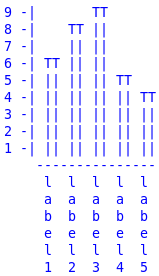

# MibiPlot
Make plots in a console. Tested with python 2.7 (should work with python 3).
## Getting Started
### Buid a new plot
`plot = Plot(type = str, values = list, labels = list, height = None (int), width = None (int))`
### Bar plot
`Plot.bar(plot)`
### String from a plot
`Plot.buildstr(plot, list)`
### Example
#### Code
```
plot = Plot("bar", [6, 8, 9, 5, 4], ["label1", "label2", "label3", "label4", "label5"], 9)
print(Plot.buildstr(plot, Plot.bar(plot)))
```
#### Result
```
9 -|       TT       
8 -|    TT ||       
7 -|    || ||       
6 -| TT || ||       
5 -| || || || TT    
4 -| || || || || TT 
3 -| || || || || || 
2 -| || || || || || 
1 -| || || || || || 
    --------------- 
     l  l  l  l  l  
     a  a  a  a  a  
     b  b  b  b  b  
     e  e  e  e  e  
     l  l  l  l  l  
     1  2  3  4  5  
```

